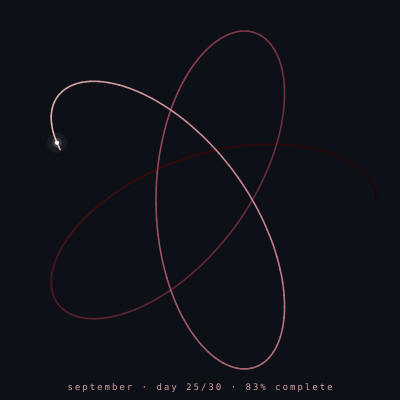

<!-- README.md — Martina Perez — martinapm -->
 
<!-- ═══════ HEADER ═══════ -->
 

 

&nbsp;

&nbsp;

 

 

 
<!-- ═══════ ABOUT ME ═══════ -->
 

 
### ✦ &nbsp; About Me &nbsp; ✦
 

 
 

 
> &nbsp; Curious by nature, methodical by training, developer by choice &nbsp;

 
 
 

 

&nbsp;&nbsp;

&nbsp;&nbsp;

&nbsp;&nbsp;

 
  

<!-- COUNTER:START -->

<!-- COUNTER:END -->

 

 
<!-- ═══════ EDUCATION ═══════ -->
 

 
### ✦ &nbsp; Education &nbsp; ✦
 
 
 
| | Degree | Status |
| :---: | :--- | :---: |
| 🎓 | **Information and Documentation** — UGR | ✅ Completed |
| 📘 | **DAW** — Web Application Development | ✅ Completed |
| 📗 | **DAM** — Multiplatform Application Development | 🔄 In progress |
 

 

<!-- ═══════ TECH STACK ═══════ -->
 

 
### ✦ &nbsp; Tech Stack &nbsp; ✦
 
 
 
**Frontend**
 
<table>
  <tr>
    <td align="center" width="80"> Angular</td>
    <td align="center" width="80"> CSS</td>
    <td align="center" width="80"> HTML</td>
    <td align="center" width="80"> jQuery</td>
    <td align="center" width="80"> JavaScript</td>
    <td align="center" width="80"> React</td>
    <td align="center" width="80"> Tailwind</td>
    <td align="center" width="80"> TypeScript</td>
  </tr>
</table>
 
**Backend & Databases**
 
<table>
  <tr>
    <td align="center" width="70"> Cassandra</td>
    <td align="center" width="70"> Java</td>
    <td align="center" width="70"> MongoDB</td>
    <td align="center" width="70"> MySQL</td>
    <td align="center" width="70"> Node.js</td>
    <td align="center" width="70"> PHP</td>
    <td align="center" width="70"> PostgreSQL</td>
    <td align="center" width="70"> Python</td>
    <td align="center" width="70"> R</td>
    <td align="center" width="70"> Spring</td>
  </tr>
</table>
 
**DevOps & Cloud**
 
<table>
  <tr>
    <td align="center" width="80"> Azure</td>
    <td align="center" width="80"> Cloudflare</td>
    <td align="center" width="80"> Docker</td>
    <td align="center" width="80"> Git</td>
    <td align="center" width="80"> GitHub</td>
    <td align="center" width="80"> Linux</td>
    <td align="center" width="80"> Maven</td>
    <td align="center" width="80"> Ubuntu</td>
  </tr>
</table>
 
**Design & Productivity**
 
<table>
  <tr>
    <td align="center" width="80"> Figma</td>
    <td align="center" width="80"> Notion</td>
    <td align="center" width="80"> Postman</td>
    <td align="center" width="80"> Raspberry</td>
    <td align="center" width="80"> VS Code</td>
    <td align="center" width="80"> WordPress</td>
  </tr>
</table>
 
 
 
**🧩 &nbsp; More Tools**
 
| Area | Tools |
| :--- | :--- |
| 🗃️ **Information Systems** | ABSYSNET · ALFRESCO · Protege · Digital Archiving |
| 🔧 **Development** | Drupal · JDBC · PL/SQL · StarUML · Swing · XAMPP |
| 📊 **Business** | Access · Dynamics 365 · Advanced Excel |
 

 

 
<!-- ═══════ PROJECTS ═══════ -->
 

 
### ✦ &nbsp; Projects &nbsp; ✦
 
 
 
<table>
  <tr>
    <td align="center" width="50%">
       
      
        
      My personal portfolio showcasing projects, background and skills.
       
      Clean design, smooth navigation and user-focused experience.
        
      
      
      
      
        
      
        
    </td>
    <td align="center" width="50%">
 
      
        
      Final degree project built in collaboration.
       
      A platform for rating and discovering audiovisual content
       
      with reviews, user profiles and recommendations.
        
      
      
      
      
        
      
        
    </td>
  </tr>
</table>
 
 
 

 

 

 
<!-- ═══════ GITHUB ANALYTICS ═══════ -->
 

 
### ✦ &nbsp; GitHub Analytics &nbsp; ✦
 
 
 

 
  
 

&nbsp;&nbsp;

 

 

 
<!-- ═══════ SPIROGRAPH ═══════ -->

### ✦ &nbsp; A Rose in Progress &nbsp; ✦

<!-- ═══════ QUOTE ═══════ -->

 

> ✶ &nbsp; Discipline is the key to success &nbsp; ✶

 

<!-- ═══════ FOOTER ═══════ -->

 
